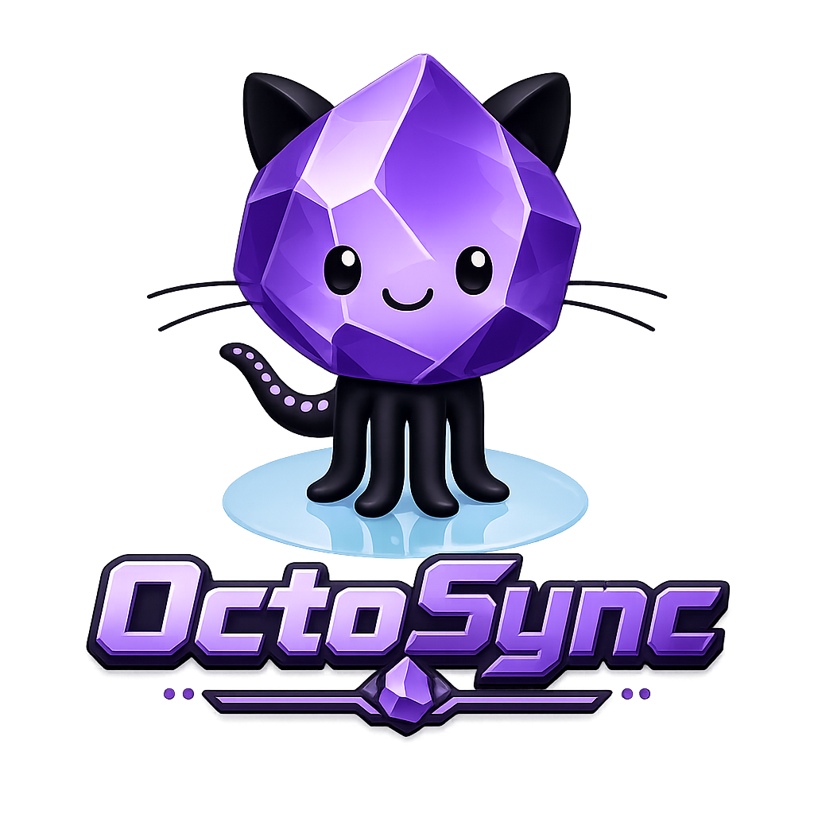
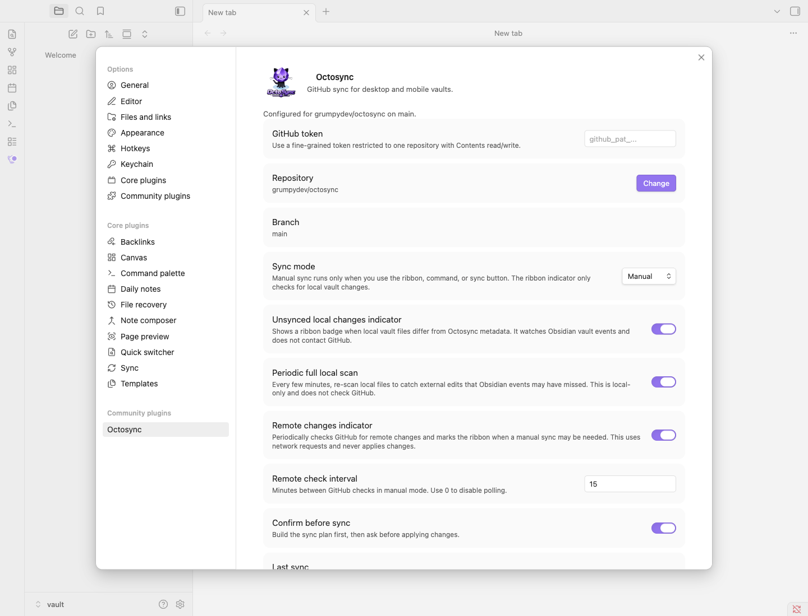

# Octosync

<p align="center">
  
</p>

Octosync is an Obsidian plugin that syncs a vault directly with GitHub without requiring a local Git install.

It is built for people who like GitHub as a durable home for their notes, but do not want every device to be a developer workstation. Phones, tablets, locked-down work laptops, and lightweight machines can all be awkward places to install, authenticate, and maintain Git. Octosync talks to GitHub's API from inside Obsidian, so the device only needs Obsidian, the plugin, and a GitHub token with access to the repository you choose.

## Why Use It

- Sync an Obsidian vault to a normal GitHub repository.
- Use GitHub-backed sync on phones and non-dev machines without local Git.
- Preview changes with simulation before applying them.
- Choose manual sync for full control or automatic sync for routine updates.
- Keep `.obsidian/**` out of sync by default, avoiding token and device-specific settings leaks.
- Detect conflicts and stop for a user decision instead of silently overwriting notes.

Octosync is deliberately conservative. It plans the sync before applying it, tracks file metadata, treats deletes carefully, and avoids partial local changes if a remote write fails.

## Sync Modes

Octosync supports two main workflows.

**Manual sync** runs only when you click the ribbon icon, use the command palette, or start sync from settings. Manual mode can also require confirmation: Octosync prepares the sync plan, shows what it intends to upload, download, or delete, and waits for approval before changing anything.

**Automatic sync** can run on startup, on an interval, or both. It uses the same planning engine as manual sync, but applies safe plans without asking each time.

The settings screen also includes **Simulate sync**. Simulation builds the same plan as a real sync and reports what would happen without changing local files, GitHub files, or Octosync metadata. It is useful before first sync, after changing repositories or branches, and any time the vault state feels uncertain.

## Change Indicators

The toolbar icon can show when Octosync sees pending local changes. This is a local-only check: it uses Obsidian file events, incremental checks, and optionally a periodic local scan. It does not contact GitHub and does not detect remote-only changes.

Manual mode can separately check GitHub for remote changes on an interval. That check is read-only and only updates the visual indicator so you know a manual sync may be needed.

## Settings



## Safety Net

Sync tools need a high bar because mistakes can damage a vault. Octosync includes unit tests for the sync engine and GitHub client, plus an Obsidian end-to-end suite that launches a disposable vault against a temporary GitHub branch.

The automated tests cover settings UI behavior, simulation, local and remote change indicators, uploads, downloads, local deletes, remote deletes, empty folders, conflict detection, conflict resolution modes, and protection against partial changes when a sync stops on conflict.

That testing does not remove the need for backups, especially while the plugin is young, but it gives the sync logic a real safety net rather than relying only on happy-path manual testing.

## Privacy And Access

Octosync enumerates vault files so it can compare local paths with the configured GitHub branch and decide what needs to sync. It deliberately excludes `.obsidian/**` so plugin settings, tokens, and device-specific Obsidian state are not uploaded as notes.

Octosync does not read from or write to the system clipboard.

## Support

Octosync is free to use. If it saves you time and you want to support ongoing development, you can sponsor the project on [GitHub Sponsors](https://github.com/sponsors/grumpydev) or send a one-off tip on [Ko-fi](https://ko-fi.com/grumpydev).

Support is optional and does not unlock features.

## Manual Installation

Build or download the plugin files, then place them in:

```text
<vault>/.obsidian/plugins/octosync/
```

The folder should contain:

```text
main.js
manifest.json
styles.css
logo.png
```

Restart Obsidian or reload plugins, then enable Octosync from Community plugins.

## GitHub Token

Octosync currently uses a fine-grained GitHub personal access token. Create one for only the repository you want to sync and grant:

- `Contents`: read and write
- `Metadata`: read

Store the token in Octosync settings inside Obsidian. Octosync excludes `.obsidian/**` from vault sync so plugin settings and tokens are not uploaded as notes.

## Development

Install dependencies:

```bash
npm install
```

Run unit tests:

```bash
npm test
```

Build the plugin:

```bash
npm run build
```

Run the development watcher:

```bash
npm run dev
```

Build and install into a local vault:

```bash
npm run local-install -- "/path/to/Your Vault"
```

Regenerate the settings screenshot:

```bash
npm run screenshot:settings
```

The screenshot helper uses a disposable vault under `tmp/screenshots/` and refuses to run while Obsidian is already open.

## End-to-End Tests

The E2E suite launches Obsidian with a disposable vault under `tmp/e2e/`, installs the built Octosync plugin into that vault, and syncs against a temporary `octosync-e2e-*` branch in a throwaway GitHub repository.

Create the local E2E environment file:

```bash
cp env.e2e.sample .env.e2e
```

Fill in:

```text
OCTOSYNC_E2E_GITHUB_TOKEN=
OCTOSYNC_E2E_OWNER=
OCTOSYNC_E2E_REPO=
```

Use a repository dedicated to testing. The token should have read/write contents access to that repository.

Run the suite:

```bash
npm run test:e2e
```

By default, the harness cleans up the temporary vault and GitHub branch. Set `OCTOSYNC_E2E_KEEP_ARTIFACTS=true` to keep them for inspection.

On macOS, the harness refuses to start if another Obsidian process is already running because Electron can reuse an existing app instance. The harness verifies that Obsidian opened the disposable vault before it enables or exercises Octosync. If your Obsidian build shows the "Trust author and enable plugins" prompt, confirm it once after checking the visible vault path matches the path printed by the harness.

Useful debugging flags:

```text
OCTOSYNC_E2E_INSPECT_ON_FAILURE=true
OCTOSYNC_E2E_VERBOSE=true
OCTOSYNC_E2E_ALLOW_EXISTING_OBSIDIAN=true
```

Only use `OCTOSYNC_E2E_ALLOW_EXISTING_OBSIDIAN=true` when deliberately debugging startup behavior.

## License

MIT
